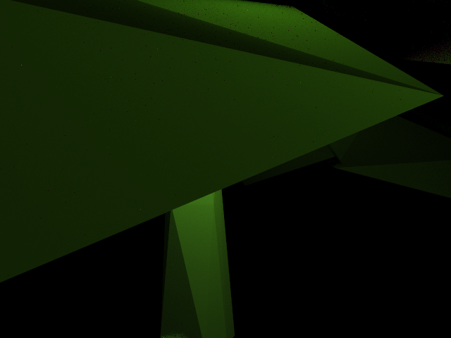

# CSE168 Final

#### By Yuning Wen

### Proposal

This is the final project for UCSD CSE168 SP24. I'm planning to do the homogeneous volumes and may finally finish it with different scenes or even Heterogeneous volumes in some way if possible. First of all, these are some of the pictures that inspire me to do the homogeneous volume.

- From Stanford CS 348b competition
- From Tyndall effect

Then, I have read some of the materials about the homogeneous volume and currently I am trying to set up the scene for the final rendering
- The sample image from previous homework

- The empty room that may be easier to test rendering

- Trying to set up some objects from online resources

This document may also chnage in the future before submitting the final result.

Materials:
- [Source 1](https://graphics.pixar.com/library/ProductionVolumeRendering/paper.pdf)
- [Source 2](https://en.wikipedia.org/wiki/Beer%E2%80%93Lambert_law)
