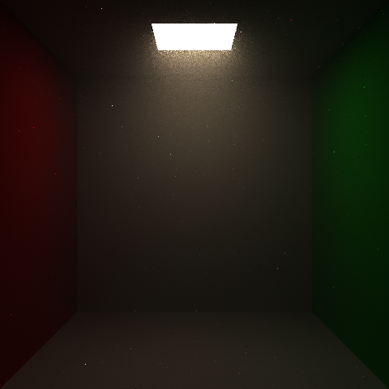

# CSE168 Final Project - Volumetric 

#### By Yuning Wen

## Proposal

//This is the final project for UCSD CSE 168 SP24. I'm planning to do the homogeneous volumes and may finally finish it with different scenes or even Heterogeneous volumes in some way if possible. First of all, these are some of the pictures that inspire me to do the homogeneous volume.

For the final project for UCSDE CSE 168 SP24, I'm trying to approach the homogeneous volumetric rendering with a single volume that holds the whole space. The following pictures are some examples that inspire me to do the volumetric rendering.

- From Stanford CS 348b competition

- From Tyndall effect

Due to the accessibility and the nice effect of this algorithm, I decide to have a try to approach and implement this algorithm.

## Mathematics and formulas

[Lecture Slides](https://cseweb.ucsd.edu/~viscomp/classes/cse168/sp24/lectures/168-lecture15.pdf) is one of the most important source that I'm using, and I have also used the material from CSE 272 taught by Tzu-Mao Li in Winter 2024, both the [slide](https://cseweb.ucsd.edu/~tzli/cse272/wi2024/lectures/09_participating_media.pdf) (only this one is considered since only homogeneous volumetric rendering is trying to be approached) and the [material in homework](https://cseweb.ucsd.edu/~tzli/cse272/wi2024/homework2.pdf).

Without consider the emissive volumes, we then only need to consider a homogeneous volume, which takes in two constants: sigma_a, the coefficient for absorbtion; and sigma_s, the coefficient for scattering. Here's the formula that I'm trying to approach through path tracing:

$$L(p(0), \omega) = \int_0^{t_{\text{hit}}} \exp(-\sigma_t t) \sigma_s L_{\text{scatter}}(p, \omega) d t + \exp(-\sigma_t t_{\text{hit}}) L_e(p(t_{\text{hit}}))$$

$$L_{\text{scatter}}(p, \omega) = \int_{S^2} \rho(p(t), \omega, \omega') L(p(t), \omega') d \omega'$$

These formulas should call each other recursively begin with $L(p(0), \omega)$ that takes the origin and direction calculated through the position of the pixel on the final image and other information set inside the scene. Termination should be executed when a certain number of depth is reached or by using the Russian roulette. When path hits object instead of scattered in the homogeneous volume, we should then consider back to the normal path tracing with BRDF and NEE, or even MIS.

By using path tracing, instead of doing the whole real integration, we always use Monte Carlo to estimate the final result by sampling a random point in the scope of the integration and then divide the final result by the importance pdf to try to approach the result of the integration. As the number of sample increases, the average of the integration result may better approach the final result, and thus finer rendering results are expected as the number of sample per pixel (spp) increases.

## Rendering Result

First of all, I may not promise that I have implemented my algorithms totally correct. But the following pictures are the rendering result in some simple scene (with BRDF importance sampling and Next Event Estimation considered, and also Russian roulette).

This first one only consider one scatter (a test scene set by myself, with sigma_a = 0.006, sigma_s = 0.009, spp = 256)

For this picture above, the next event estimator only tries to get light from the quad light above and all the spheres only has emission and no other settings. (When sphere hitted, return the emission of the sphere)

The following pictures are all approached with the my whole implementation (emission of objects not considered, lights do have intensity):

- the cornell box used in HW4 this quarter (sigma_a = 0.07, sigma_s = 0.03, spp = 1024)

- the empty cornell box with the sphere in the previous one removed (sigma_a = 0.23, sigma_s = 0.02, spp = 2048)

- a foggy cornell box with two spheres inside (sigma_a = 0.275, sigma_s = 0.025, spp = 10000)

(p.s.: the last three scenes only have difference in the number of spheres and the parameter, the setting of light and all other shapes and materials are the same, and all of them are considered to be contained in a single homogeneous volume.)

## Future

Though I may not update here, I may have a try to set up different volumes in a scene and volumes inside volumes. If possible, I'd like to also have a try to implement the heterogeneous volumetric rendering.

## Link for some References used

Great thanks to the following materials I used as references:
- [Source 1](https://graphics.pixar.com/library/ProductionVolumeRendering/paper.pdf)
- [Source 2](https://en.wikipedia.org/wiki/Beer%E2%80%93Lambert_law)
- [Slide from Class](https://cseweb.ucsd.edu/~viscomp/classes/cse168/sp24/lectures/168-lecture15.pdf)
- [Source from CSE272 Winter 2024](https://cseweb.ucsd.edu/~tzli/cse272/wi2024/)
